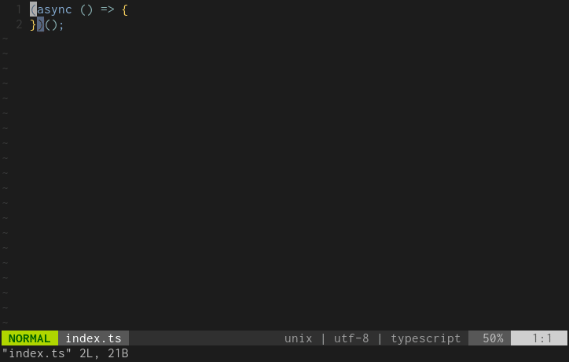

# playwright-webextext

This extension library enables loading firefox add-ons and chromium extensions from the local filesystem for [playwright][].



## Install

Install by `npm`:

```console
$ npm install --save playwright-webextext
```

or install with `yarn`:

```console
$ yarn add playwright-webextext
```

## API

### withExtension()

The method provides a custom browser that loads temporary extensions from the local filesystem.

#### Usage

```typescript
import { firefox, chromium } from "playwright";
import { withExtension } from "playwright-webextext";

const launchFirefox = async () => {
  const browserTypeWithExtension = withExtension(
    firefox,  // base browser type
    "path/to/your/extensions",  // local directory containing manifest.json
  );
  // launch a browser
  const browser = await browserTypeWithExtension.launch();

  const page = await browser.newPage();
  await page.goto("https://example.com/");
};

const launchChromium = async () => {
  const browserTypeWithExtension = withExtension(
    chromium,  // base browser type
    "path/to/your/extensions",
  );

  // chromium extensions works only in headed browsers with persistent contexts
  const browser = await browserTypeWithExtension.launchPersistentContext("", {
    headless: false,
  });

  const page = await browser.newPage();
  await page.goto("https://example.com/");
};

launchFirefox();
launchChromium();
```

### createFixture()

The method provides custom fixtures that enable browsers to load add-ons and extensions.

#### Usage

```typescript
import { createFixture } from "playwright-webextext";

const { test, expect } = createFixture("path/to/your/extensions");

test("should launch browser with extensions", async ({ page }) => {
  await page.goto("https://example.com/");

  // ...
});
```

## How does it work

### Chromium

The playwright introduces a way to install chrome extensions in the document.  Chromium supports installing extensions via [command-line options][chrome-launch-switches].  The playwright-webextext launches a chromium browser with command-line options with extension paths.  See the following document for more details:

- [Chrome Extensions | Playwright](https://playwright.dev/docs/chrome-extensions)

Note that using chrome extensions has two limitations: 1) the browser should run on headed mode, and 2) you should launch the browser with a persistent context (`launchPersistentContext()`).

[chrome-launch-switches]: https://sites.google.com/site/chromeappupdates/launch-switches

### Firefox

Firefox provides a remote debugging server to control the browser via a [remote debugging protocol][].  This protocol also enables installing a temporary add-on.  The playwright-webextext installs add-ons by this protocol.

[remote debugging protocol]: https://firefox-source-docs.mozilla.org/devtools/backend/protocol.html

## LICENSE

[MIT](./LICENSE)

[playwright]: https://playwright.dev/
